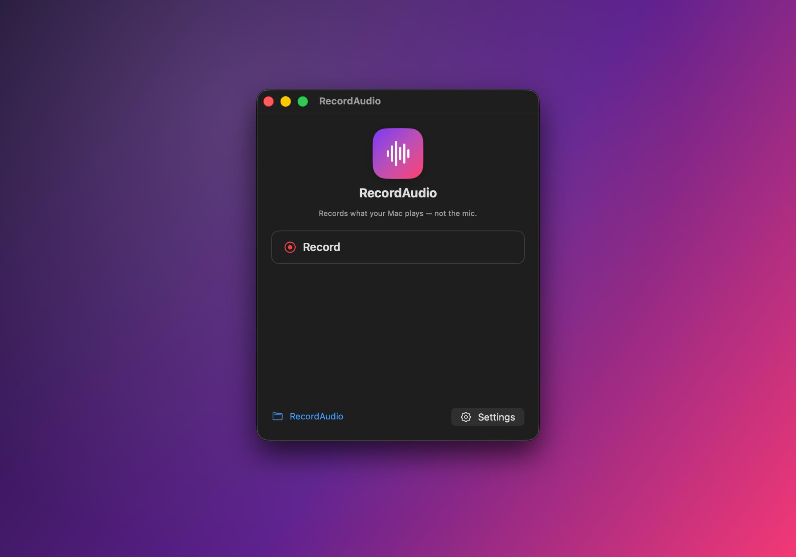

<h1 align="center">RecordAudio</h1>

<p align="center">Record your Mac's <b>system audio</b> — not the mic — to small, good-quality AAC files, as a window or menu-bar app.</p>

<p align="center">
  
</p>

<p align="center">
  <a href="https://github.com/Alyetama/RecordAudio/releases/latest/download/RecordAudio.dmg">
    <b>⬇︎ Download for macOS</b>
  </a>
  &nbsp;·&nbsp; macOS 13+ &nbsp;·&nbsp; Apple Silicon
</p>

---

## Features

- 🎧 **Records system audio, not the microphone** — captures whatever your Mac is playing (browser, music, apps).
- 🪶 **Small files, good quality** — AAC in `.m4a` (Small / Balanced / High presets; ~1 MB per minute).
- 🖥️ **Window or menu bar** — runs as a normal app window *and* an optional menu-bar icon; toggle either in Settings.
- ⚙️ **Simple settings** — pick quality, save folder, and how the app appears.
- 🔒 **No extra drivers** — uses Apple's ScreenCaptureKit; no BlackHole/Soundflower needed.

## First launch (opening an unsigned app)

RecordAudio isn't signed with an Apple Developer ID, so macOS blocks it the first
time. Any **one** of these works — you only need to do it once:

1. **Right-click to open** — in Finder, Control-click (right-click)
   **RecordAudio.app** → **Open**, then **Open** again in the dialog.
2. **Privacy & Security** — if it's still blocked on newer macOS, open
   **System Settings → Privacy & Security**, scroll down, and click
   **Open Anyway** next to the RecordAudio message, then confirm with **Open**.
3. **Terminal** — or clear the quarantine flag:
   ```bash
   xattr -dr com.apple.quarantine /Applications/RecordAudio.app
   ```

> On your first **Record**, macOS also asks for **Screen Recording** permission —
> that's the only channel macOS provides for capturing system audio. Enable
> RecordAudio under *System Settings → Privacy & Security → Screen Recording*.

## Build from source

```bash
./Icon/build_icon.sh   # (re)generate the app icon (optional)
./build.sh             # compile a signed RecordAudio.app into ./build
open build/RecordAudio.app
```

Requires macOS 13+ and the Swift toolchain (Xcode or Command Line Tools). See
the source in [`Sources/`](Sources/).

## License

[MIT](LICENSE) © 2026 Alyetama
